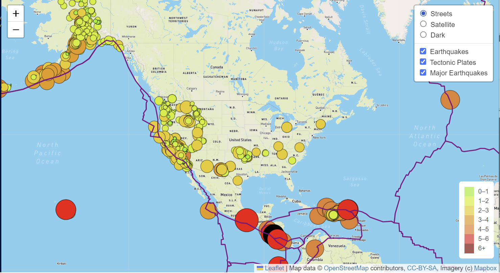
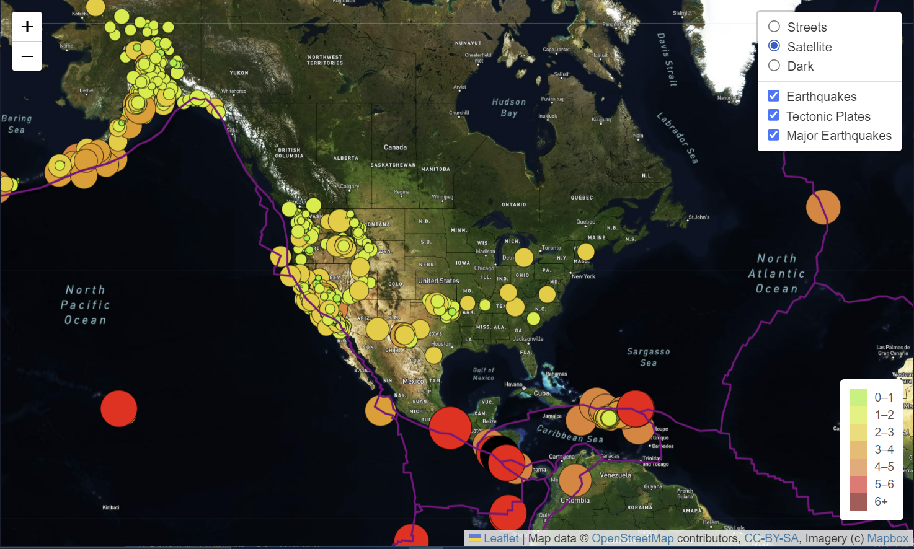
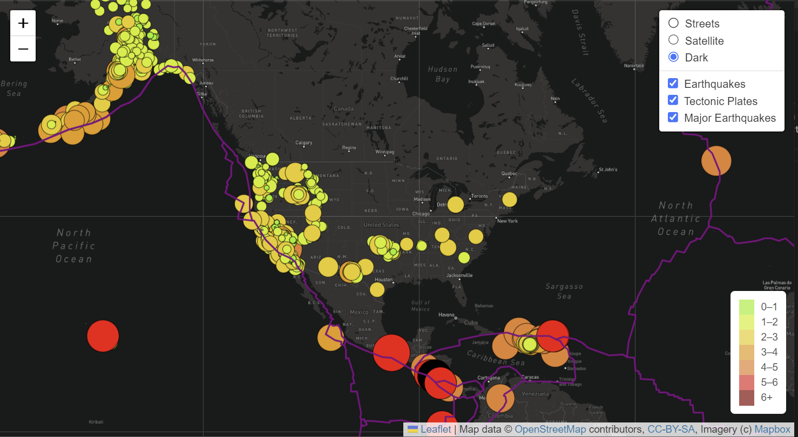

# Mapping_Earthquakes

# Project Overview

The purpose of this project was to visualize the different magnitudes of earthquakes across the world for the last seven days. 

Geographical coordinates and magnitudes of earthquake data were retrieved from a URL from the USGS website with Javascript functions and the D3.js library. 

Finally, the Leaflet library was used to add the data to an interactive map and create multiple overlays and customization.

